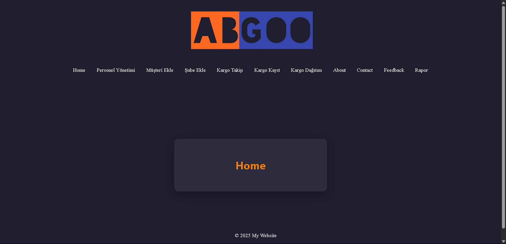
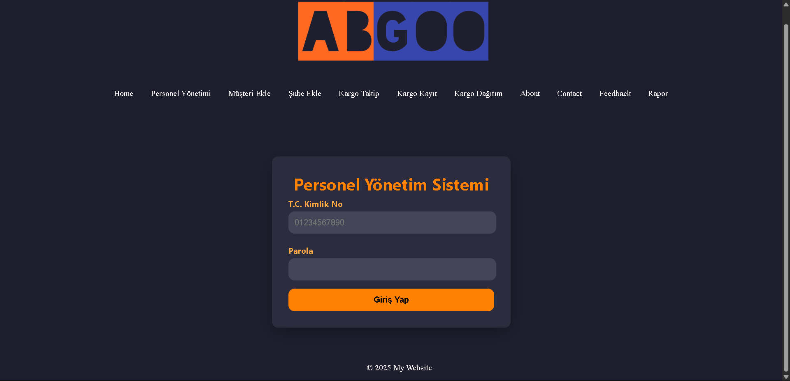
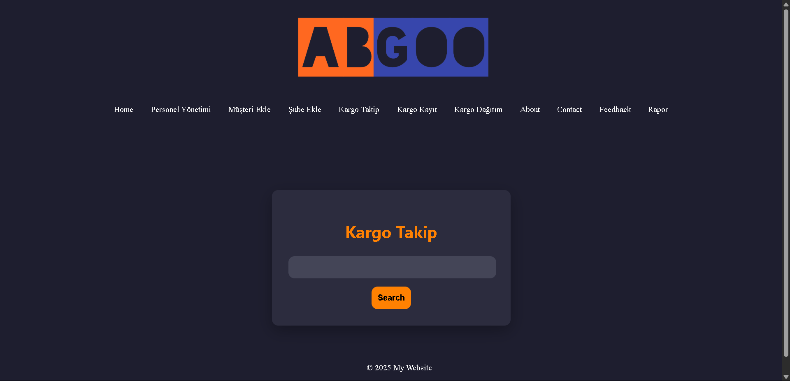
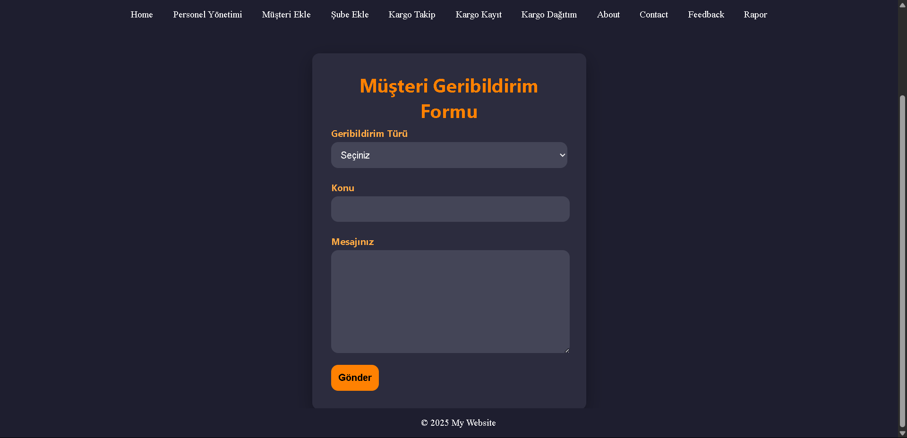

# Hypothetical Cargo Company Information System

## Purpose

This system is designed to manage cargo, workers, feedback, and cargo tracking. It is divided into two main sections: the end-user side and the worker side.

- **End-User Side**: Users can track their cargo and send feedback to the company.
- **Worker Side**: Workers can register cargo in the database, view cargo that needs to be distributed, manage the customer database, and more.
- **Manager Functions** (within the Worker Side): Managers can view which workers are assigned to which sections, see feedback report charts, add sections to the database, and perform additional administrative functions.

## Project Attributes

- Front-end: Built with HTML, CSS, and JavaScript
- Back-end: Developed using Node.js
- Database: MySQL is used for data management
- **!!Note!!**: This project runs on local servers and requires both Node.js and MySQL to function.

## Screenshots

### Home Screen  

### Personnel Management Screen  

### Cargo Tracking Screen  

### Feedback Screen  

